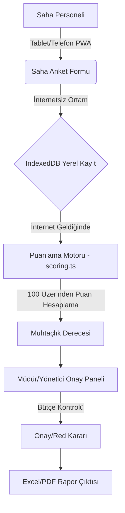

# 📋 T.C. EDİRNE SYDV — SOSYAL YARDIM DEĞERLENDİRME VE PUANLAMA YÖNERGESİ
## Kurumsal Sistem Analizi, Teknik Mimari ve Literatür Raporu

**Hazırlanma Amacı:** Sistemin teknik altyapısının, iş akışlarının ve kullanılan 100 puanlık algoritmanın detaylı kurumsal analizini sunmaktır.

---

## 1. YÖNETİCİ ÖZETİ (EXECUTIVE SUMMARY)

Sosyal Yardımlaşma ve Dayanışma Vakfı (SYDV) Karar Destek Sistemi, vatandaşların nakdi ve ayni yardım taleplerini değerlendirmek için geliştirilmiş **PWA (Progressive Web App)** tabanlı, çevrimdışı (offline-first) çalışabilen modern bir web uygulamasıdır. 

Uygulamanın temel amacı, sosyal inceleme görevlilerinin sahada topladığı verileri **100 Puanlık matematiksel bir algoritmaya** tabi tutarak insan inisiyatifinden ve kayırmacılıktan uzak, tamamen **şeffaf, ölçülebilir ve adil** bir muhtaçlık derecelendirmesi yapmaktır.

---

## 2. TEKNİK MİMARİ VE BİLEŞENLER

Sistem, en güncel web teknolojileri kullanılarak yüksek performans, güvenlik ve sahada erişilebilirlik ilkeleriyle inşa edilmiştir.

### 2.1 Kullanılan Teknolojiler
- **Altyapı (Framework):** Next.js 14 (App Router mimarisi)
- **Programlama Dili:** TypeScript (Tip güvenliği ve hata minimizasyonu)
- **Arayüz (UI):** Tailwind CSS ve Framer Motion (Akıcı ve modern animasyonlar)
- **Veri Saklama (Storage):** IndexedDB (Tarayıcı tabanlı, internet bağlantısı kopukluklarında veri kaybını önler)
- **Raporlama Çıktıları:** ExcelJS (.xlsx dışa aktarım) ve yerleşik Print API (PDF)

### 2.2 Mimari Akış ve Kararlar (Architecture Flow)


**Temel Tasarım Kararı (Offline-First):** Köy ve kırsal alanlarda internet bağlantısının zayıf olması riski göz önüne alınarak sistem doğrudan tarayıcı belleğine (IndexedDB) kayıt yapacak şekilde kurgulanmıştır.

---

## 3. İŞ AKIŞI VE ROL YÖNETİMİ

Sistemde iki ana rol bulunmaktadır: **Müdür (Yönetici)** ve **Personel (Sosyal İncelemeci)**.

### 3.1 Süreç Adımları
1. **Toplantı Başlatma (Müdür):** Dağıtılacak toplam bütçe girilerek bir toplantı dosyası (Örn: "Eylül 2026 Nakdi Yardım") açılır.
2. **Saha İncelemesi (Personel):** Vatandaş ziyaret edilir, 10 adımlı dijital sihirbaz ile form doldurulur. Personel, baskı altında kalmamak için "Gizlilik Modu" sayesinde ailenin kaç puan aldığını ekranda göremez.
3. **Otomatik Algoritma İşlemi:** Form kaydedildiği an `scoring.ts` dosyası çalışır ve haneye 0-100 arası bir puan atar.
4. **Onay Mekanizması (Müdür):** Müdür paneli açar; sistemin en yüksek puanlıdan (En muhtaçtan) en düşük puanlıya doğru sıraladığı listeyi görür. Onay verdikçe sistem kalan bütçeyi otomatik hesaplar.
5. **Raporlama:** Toplantı bitiminde tek tıkla mizan, Excel listesi ve detaylı PDF dökümleri alınır.

---

## 4. DETAYLI SİSTEM ANALİZİ: 100 PUANLIK DEĞERLENDİRME ALGORİTMASI

Uygulamanın beyni olan `lib/scoring.ts` dosyası içindeki algoritma, Dünya Bankası ve OECD literatürüne göre ağırlıklandırılmış 6 modülden (Maks 100 Puan) oluşur.

### 4.1 Modül Analizleri

| Modül Kodu | Açıklama | Maksimum Puan | Literatür Dayanağı |
|---|---|---|---|
| **A** | Ekonomik Durum (Gelir testleri, çalışan yokluğu, SGK durumu) | 25 Puan | Means Testing (Gelir Hedeflemesi) |
| **B** | Dezavantajlı Bireyler (Ağır engelli, evde bakım, hastalık, yetim) | 25 Puan | BM Çoklu Kırılganlık İlkesi (Multidimensional Poverty) |
| **C** | Sosyal Kırılganlık ve Nüfus (Şiddet mağduru, hane büyüklüğü) | 15 Puan | OECD Modifiye Eşdeğerlik Ölçeği |
| **D** | Eğitim ve Çocuk (Eğitim kademesine göre artan çocuk yardımı) | 15 Puan | Şartlı Eğitim Yardımı (ŞEY) Prensipleri |
| **E** | Barınma ve Eşya (Evsizlik, hasar durumu, beyaz eşya eksikliği) | 10 Puan | UNDP Barınma Endeksi |
| **F** | Kanaat (Personelin sahada gördüğü hijyen, aciliyet, sosyal destek) | 10 Puan | Professional Judgment (Sosyal Hizmet Uzman Kanaati) |
| **Toplam** | | **100 Puan** | |

### 4.2 Güvenlik Filtreleri ve Ceza Mekanizması (Penalty Logic)
Bir hanenin puanı 90 bile olsa, sistem adaletsizliği önlemek için aşağıdaki durumlarda "Varlık Testi (Asset Test)" cezaları uygular:

- **Araç Kaydı:** `-15 Puan`
- **Birden Fazla Taşınmaz (Tapu):** `-20 Puan`
- **Aktif SGK'lı Çalışan:** `-5 Puan`
- **Yardım Yığılması (Mükerrerlik):** Son 3 ay içinde yardım alınmışsa hane kişi sayısı çarpı `-5 Puan`. (Amaç yardımı sürekli aynı kişilere değil tabana yaymaktır).
- **Gerçeğe Aykırı Beyan (Fraud):** `totalScore = 0`. Başvuru derhal reddedilir (İptal durumu).

---

## 5. ALGORİTMA KOD (FONKSİYON) ANALİZİ

Aşağıda `scoring.ts` içindeki ana fonksiyonun sadeleştirilmiş teknik mantığı yer almaktadır:

```typescript
// 1. Her bir bölümün puanı kendi içinde hesaplanır ve tavan değere (Math.min) sınırlandırılır.
const scoreA = Math.max(0, Math.min(rawScoreA, 25)); // Ekonomi maks 25
const scoreB = Math.min(rawScoreB, 25); // Dezavantaj maks 25
// ... Diğer C, D, E, F hesaplamaları ...

// 2. Ceza (Penalty) durumları toplanır.
let scorePenalty = 0;
if (state.a_aracSahibi) scorePenalty += 15;
// ... diğer cezalar ...

// 3. Ham puan toplanıp ceza puanı çıkarılır. 0'ın altına düşmesi engellenir.
const rawTotal = scoreA + scoreB + scoreC + scoreD + scoreE + scoreF;
let totalScore = state.falseStatement ? 0 : Math.max(0, Math.round(rawTotal - scorePenalty));

// 4. Baraj/Taban Puan Koruması
// Çok fakir olan (geliri olmayan) haneler eğer ceza almamışlarsa sistemin belirlediği en alt yardım eşiğinin (örn: 10 puan) altına düşürülmez.
```

---

## 6. KURUMSAL VE OPERASYONEL FAYDALAR

1. **Kanıta Dayalı Karar Alma:** Vakıf mütevelli heyeti toplantılarında kararlar tahmine veya hissiyata dayalı değil, uygulamanın ürettiği somut ve detaylı 100 puanlık rapora dayalı olarak verilir.
2. **Denetime Hazır Altyapı:** Olası mülki idare veya müfettiş denetimlerinde, her bir vatandaşın neden o miktarda yardım aldığı saniyesinde sistem loglarından PDF olarak belgelenebilir.
3. **Verimlilik Artışı:** Manuel hesaplama hataları ortadan kalkar. Saha personeli evrak işleriyle uğraşmaz, mobil cihazından anketi bitirdiği an iş tamamlanır.
4. **Bütçe Disiplini:** Limit aşıldığında sistem müdürü anında uyarır, açık bütçe veya bütçesiz harcama yapılması yazılımsal olarak engellenir.

**Sonuç:** Bu karar destek sistemi, T.C. Edirne SYDV'nin kaynaklarını en efektif, en adil ve en şeffaf şekilde yönetmesini sağlayan kritik bir kurumsal dijital dönüşüm (Digital Transformation) aracıdır.
